# disqRPC

Show a Discord **Rich Presence** for the games and apps you play on your Android phone.

disqRPC runs a foreground service that connects to Discord's gateway over WebSocket, watches which app is currently in the foreground, and automatically updates your Discord profile with a rich presence card (game name, details, state, and artwork), similar to how desktop Discord shows what you're playing.

> ⚠️ **Legal note:** Logging in with a **user token** (as opposed to a bot token) violates [Discord's Terms of Service](https://discord.com/terms) and may result in your account being disabled. disqRPC supports both modes for developer flexibility, but you use your own account at your own risk. For safe, public usage, use a bot token.

---

## Features

- **Automatic game detection**, Uses Usage Stats to detect the foreground app and sets the corresponding Rich Presence automatically.
- **One-tap whitelisting**, When a new app is detected, a notification lets you add it to your whitelist without leaving your game.
- **Play Store metadata**, Fetches the app's name and icon automatically from the Google Play Store when you add a game.
- **Manual presence override**, Set a custom status with your own name, details, state, and large/small images.
- **Image support**, Local images are uploaded (via [catbox.moe](https://catbox.moe)) and registered with Discord's `external-assets` endpoint so they actually render in your presence.
- **Manual or "Select App"**, Add games by typing a package name or by picking from your installed apps.
- **Notification-triggered presence**, An optional Notification Listener can trigger presence for apps that notify you when a session starts.
- **Encrypted credential storage**, Tokens are stored with `EncryptedSharedPreferences` backed by the Android Keystore.
- **Live in-app log console**, Debug the WebSocket connection and presence payloads in real time.
- **Auto-reconnect**, Exponential backoff (up to 10 attempts) keeps your presence alive across network changes and Discord-side reconnects.
- **Persistent foreground service**, Runs reliably in the background with a status notification.

## How it works

1. You save a **Discord token** and a **Master Application ID** (from your Discord Developer Application) in Settings.
2. You press **Connect**. The app opens a WebSocket to `wss://gateway.discord.gg` and sends an `IDENTIFY` payload — either as a bot (intents = 0) or as a desktop user (desktop client spoofing).
3. A `ForegroundAppDetector` polls `UsageStatsManager` every few seconds. When a whitelisted game comes to the foreground, the app builds a presence payload and sends it over the WebSocket (`PRESENCE_UPDATE`, OP 3).
4. When you leave the game (or the screen turns off), the presence is cleared after a 30-second grace period.

```mermaid
sequenceDiagram
    autonumber
    actor User
    participant App as disqRPC App
    participant Gateway as Discord Gateway<br/>(wss://gateway.discord.gg)
    participant Discord as Discord Clients

    rect rgb(38, 44, 60)
        Note over App, Gateway: Phase 1 - Connect & handshake
        User->>App: Save token + App ID, tap Connect
        App->>App: Read token (encrypted storage)
        App->>Gateway: Open WebSocket
        Gateway-->>App: Hello (OP 10) + heartbeat_interval
        App->>Gateway: Identify (OP 2) [bot or user-spoof]
        loop Every heartbeat_interval
            App->>Gateway: Heartbeat (OP 1)
            Gateway-->>App: Heartbeat ACK (OP 11)
        end
        Gateway-->>App: READY (OP 0)
    end

    rect rgb(50, 45, 38)
        Note over App, Discord: Phase 2 - Foreground detection
        loop Every 3s (screen on)
            App->>App: Poll UsageStatsManager
        end
        App->>App: Foreground app changed
        App->>App: Look up GameConfig in Room
        alt Whitelisted & enabled
            App->>App: Resolve images (upload + external-assets register)
            App->>Gateway: Presence Update (OP 3)
            Gateway-->>Discord: Push new presence to friends
        else Not whitelisted
            App-->>User: "Add game to Rich Presence?" notification
            User->>App: Tap "Add"
            App->>App: Save GameConfig (+ Play Store metadata)
            App->>Gateway: Presence Update (OP 3)
            Gateway-->>Discord: Push new presence to friends
        end
        Note over App: Game left / screen off -> clear presence after 30s
    end
```





## Tech Stack

| Area | Technology |
| --- | --- |
| Language | Kotlin |
| UI | Jetpack Compose (Material 3), Navigation Compose, Coil |
| Networking | OkHttp (WebSocket + HTTP), Retrofit, Gson, Jsoup |
| Local storage | Room (game configs), EncryptedSharedPreferences / Android Keystore (credentials) |
| Architecture | MVVM with ViewModels + StateFlow, service-based background work |
| Build | Gradle (Kotlin DSL), AGP 8.7.3, Kotlin 2.0.21, KSP |

## Requirements

- Android **9 (API 29)** or higher
- **Usage Access** permission (to detect foreground apps)
- **Notification Access** (optional, for notification-triggered presence)
- A Discord **user token** or **bot token**, plus a Discord **Application ID**

## Getting Started

### 1. Build the app

Clone the repo and build with Gradle:

```bash
git clone https://github.com/vermilion10/disqrpc.git
cd disqrpc
./gradlew assembleDebug
```

Open the project in Android Studio (latest stable) and run on a device/emulator running API 29+.

### 2. Create a Discord application

1. Go to the [Discord Developer Portal](https://discord.com/developers/applications) and create a new application.
2. Copy its **Application ID** (the "Client ID").
3. If using a bot: create a bot in the **Bot** tab and copy its **Token**.

### 3. Configure the app

1. Open the **Settings** tab.
2. Paste your token and the Application ID, then tap **Save Credentials**.
3. Grant the requested permissions:
   - **Notification Access** — `Settings → Special access`
   - **Disable Battery Optimization** — recommended for reliable background detection
   - **Usage Access** — `Settings → Security & privacy → Usage access` (must be enabled for game detection)
4. Tap **Connect**. The status indicator in the top bar should turn green once connected.

### 4. Add games

- Tap the **+** button on the Dashboard to add a game by package name (e.g., `com.mojang.minecraftpe`) or pick one from your installed apps.
- The app scrapes the game's name and icon from the Google Play Store automatically.
- Alternatively, launch a new app while connected and tap **Add** on the whitelist prompt notification.

## Project Structure

```
app/src/main/java/com/github/vermilion10/disqrpc/
├── MainActivity.kt                  # Single-activity Compose entry point
├── data/
│   ├── local/                       # Room database + GameConfig entity
│   └── remote/                      # Google Play Store scraper
├── service/
│   ├── RPCForegroundService.kt      # WebSocket gateway connection + presence engine
│   ├── ForegroundAppDetector.kt     # UsageStats-based foreground detection
│   ├── NotificationSensorService.kt # Notification-listener presence triggers
│   └── WhitelistReceiver.kt         # Handles the "Add game?" notification action
├── ui/
│   ├── MainScreen.kt                # Scaffold, top bar, bottom navigation
│   ├── MainViewModel.kt             # ViewModel + credential/permission helpers
│   └── screens/                     # Dashboard, CustomStatus, Logs, Settings
└── util/
    ├── ConnectionManager.kt         # Global connection/presence state (StateFlow)
    ├── PresencePayloadBuilder.kt    # Builds Rich Presence JSON payloads
    ├── AssetResolver.kt             # Resolves image values → mp: keys
    ├── DiscordAssetRegistrar.kt     # Registers URLs via external-assets API
    ├── ImageUploader.kt             # Uploads local images to catbox.moe
    ├── TokenManager.kt              # Encrypted credential storage
    └── Logger.kt                    # In-app log buffer (max 200 entries)
```

## Permissions

| Permission | Purpose |
| --- | --- |
| `INTERNET` | WebSocket + HTTP API calls |
| `FOREGROUND_SERVICE` / `FOREGROUND_SERVICE_SPECIAL_USE` | Persistent gateway service |
| `POST_NOTIFICATIONS` | Service + whitelist prompt notifications |
| `BIND_NOTIFICATION_LISTENER_SERVICE` | Notification-triggered presence |
| `PACKAGE_USAGE_STATS` | Detect the foreground app |
| `REQUEST_IGNORE_BATTERY_OPTIMIZATIONS` | Keep detection alive in the background |

## License

This project is provided for educational and personal use. It is not affiliated with or endorsed by Discord Inc.
